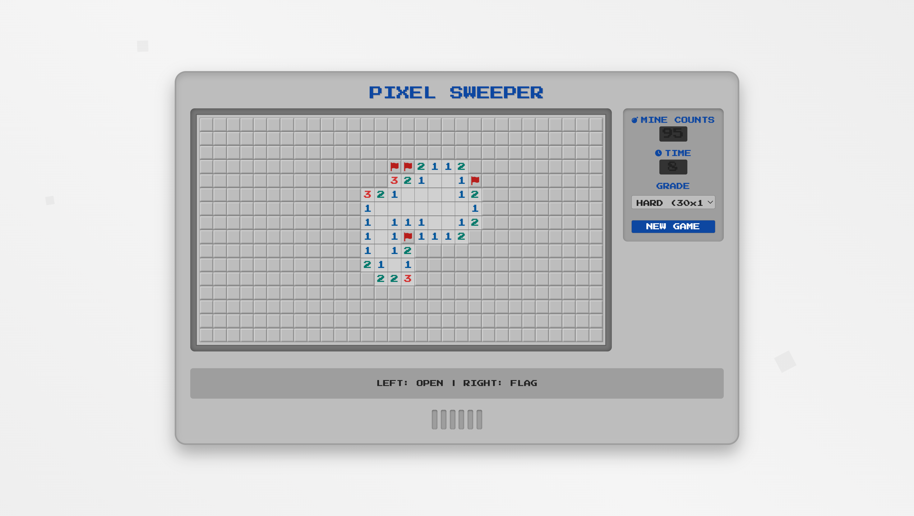

    

<h1 align="center">奇妙游戏盒🔮  Fantastic Game Box 🚀</h1>

    
    <a href="https://github.com/Azure12355/fantastic-game-box/commits" target="_blank">
    
    
     
     
     

  <strong>奇妙游戏盒：网页游戏即点玩，乐趣无穷尽！
     <em>持续更新 ing～</em>
  </strong>

---

欢迎来到奇妙游戏盒！这是一个汇集了海量经典与创新在线HTML5游戏的乐园。无需繁琐下载，即点即玩，带您重温美好时光，探索充满无限可能的奇妙游戏新境界！

➡️ **[在线体验奇妙游戏盒](https://treasure.weilanx.com/fantastic-game-box/index.html)** ⬅️ 
➡️ **[项目开源地址](https://github.com/Azure12355/fantastic-game-box)**

## 🌟 项目简介 (About The Project)

“奇妙游戏盒”源于一份对经典游戏的热爱和对便捷娱乐的追求。 我们致力于搜集和创作那些能够点亮您闲暇时刻的HTML5游戏，让您无需等待，即刻沉浸在纯粹的游戏乐趣中。 每一款游戏都经过精心挑选或独立开发，力求在小巧的体积内带来丰富的乐趣。我们希望这里能成为您放松心情、挑战自我、与朋友分享快乐的小天地。

## 🎯 主要特性 (Features)

* 🎮 **多样游戏类型**: 涵盖休闲益智、动作冒险、经典街机等多种类型，满足不同玩家的口味。
* ⚡ **即点即玩**: 所有游戏均基于HTML5技术，无需下载安装，点击即可在浏览器中直接畅玩。
* 📱 **跨设备兼容**: 大部分游戏良好适配PC、平板和智能手机，随时随地享受流畅体验。
* 💰 **完全免费**: 所有游戏均可免费在线畅玩，无任何付费订阅。
* 🔄 **持续更新**: 我们不断努力开发和搜罗新的HTML游戏，游戏库定期更新，带来持续新鲜感。
* 🛡️ **安全纯净**: 注重用户体验，承诺无恶意广告、无插件困扰，提供安全纯净的游戏环境。
* ☁️ **轻量便捷**: 无需下载安装，不占用设备存储空间，轻松娱乐。

## 🕹️ 游戏乐园 (Game Paradise)

这里汇集了我们精心制作和挑选的HTML游戏，点击卡片，即刻进入游戏世界！

目前已收录的游戏包括：

* 🧱 **打砖块 (Brick Breaker)**: 经典的跳跃，挑战你的反应极限！
* 🐟 **大鱼吃小鱼 (Big Fish Eats Little Fish)**: 操控大鱼，吞噬小鱼，成长为海洋霸主！
* 💣 **扫雷 (Minesweeper)**: 经典扫雷，挑战你的智慧！
* 🟡 **吃豆人 (Pacman)**: 经典吃豆人，吞豆躲鬼，乐趣无穷！
* 🛸 **星际迷航 (Starship Odyssey)**: 驾驶星舰，探索浩瀚宇宙！
* 🏎️ **极速狂飙 (Speed Racing)**: 狂飙街头，改装神车，挑战极限速度！
* 🐍 **贪吃蛇 (Snake)**: 经典贪吃蛇，吞食成长，挑战无尽！
* 🧱 **俄罗斯方块 (Tetris)**: 经典俄罗斯方块，堆叠消除，挑战极限！

... 更多精彩游戏正在火速制作和添加中，敬请期待！

## 🚀 如何开始 (Getting Started)

开启您的奇妙游戏之旅仅需三步：

1.  🔎 **浏览游戏**: 探索不同分类或直接查看我们的推荐。
2.  🖱️ **点击选择**: 挑选一款您感兴趣的游戏。
3.  🎉 **立即畅玩**: 无需等待，直接开始您的游戏冒险！

## 🧩 游戏分类 (Game Categories)

我们精心将游戏归类，方便您快速找到心头好：

* 💡 **休闲益智**: 轻松烧脑，老少咸宜
* 🏃 **动作冒险**: 刺激挑战，勇往直前
* 👻 **经典街机**: 复古怀旧，重温经典
* 🏰 **策略经营**: 运筹帷幄，决胜千里
* 👨‍👩‍👧‍👦 **多人互动**: 与友同乐，竞技比拼
* 🎨 **创意工坊**: 脑洞大开，自由创造
* 🌱 **模拟养成**: 精心培育，见证成长
* 🎶 **音乐节奏**: 律动指尖，畅享音游

## 🛠️ 技术栈 (Tech Stack)

奇妙游戏盒主要采用以下技术构建：

* **前端**: HTML5, CSS3, JavaScript
* **CSS 框架**: [Tailwind CSS](https://tailwindcss.com/)
* **图标**: [Font Awesome](https://fontawesome.com/)
* **动画库**: [AOS (Animate On Scroll Library)](https://michalsnik.github.io/aos/), [GSAP (GreenSock Animation Platform)](https://greensock.com/gsap/)
* **游戏引擎**: (根据具体游戏填写，例如 Phaser, PixiJS, أو纯原生 JavaScript)

## 🤝 如何贡献 (Contributing)

我们非常欢迎您为“奇妙游戏盒”项目贡献代码、提出建议或反馈BUG！如果您有好的想法或发现了问题，请随时通过以下方式联系我们或直接提交 Pull Request。

1.  Fork 本仓库
2.  创建您的特性分支 (`git checkout -b feature/AmazingFeature`)
3.  提交您的修改 (`git commit -m 'Add some AmazingFeature'`)
4.  推送到分支 (`git push origin feature/AmazingFeature`)
5.  开启一个 Pull Request

## 📜 版权与许可 (License)

该项目由 **[蔚蓝/蔚蓝的空间站]** 出品，保留所有权利。

建议采用 [MIT License](LICENSE) 开源。

## 📞 联系我们 (Contact)

* **项目创建者**: 蔚蓝 (Azure)
* **GitHub**: [Azure12355](https://github.com/Azure12355)
* **Email**: <azure_ylt9217@163.com> 

如果您有任何建议、疑问或合作意向，都非常欢迎与我们联系！

---

感谢您关注和支持“奇妙游戏盒”！让我们一起创造更多欢乐时光！🎉